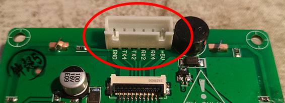
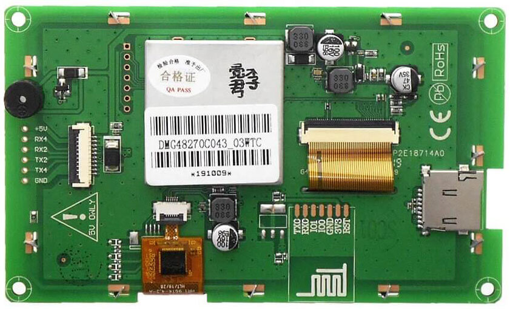
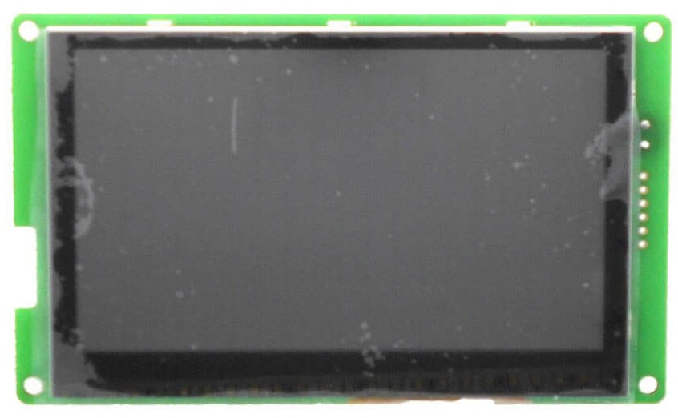
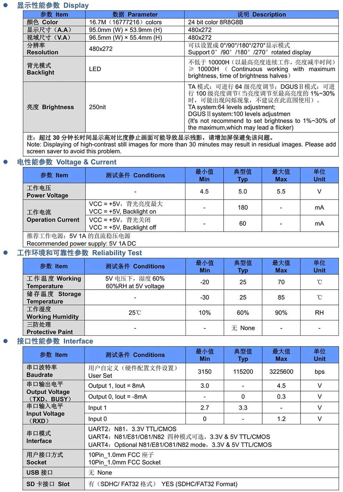
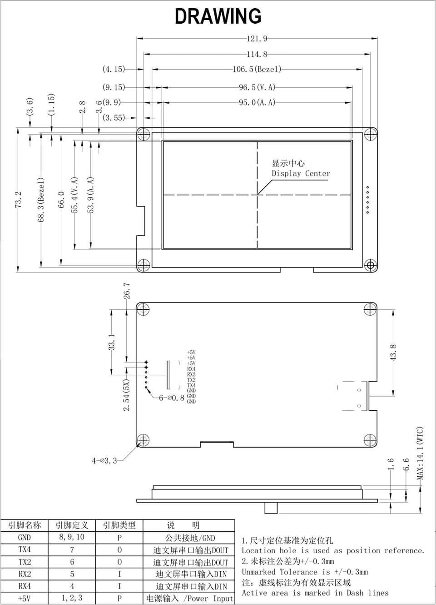

# Alternative Compatible DWIN Screen

Creality and DWIN were not very cooperative when we requested technical details about the stock CR6 printer display device, so we also searched for alternative compatible screens.

Here is one working alternative that we identified: DWIN model DMG48270C043_03W

## Reference details

* DM = smart screen
* G = 24 bit color
* 48 = horizontal resolution code, 480px
* 270 = vertical resolution, 270px
* C = commercial classification
* 043 = 4.3 inches in diagonal
* _
* 0 = basic
* 3 = hardware version
* W = no meaning, internal (?)
* @ = touch screen capacities, can be:
  * TC = capacitive
  * TR = resistive
  * N = no touch
    
## Shopping

When this note was written (2020), it sold for around 20€, shipping included.

Some links to sellers from AliExpress:

* https://www.aliexpress.com/item/4001022777228.html
* https://www.aliexpress.com/item/4000957474039.html
* https://www.aliexpress.com/item/1005002069287135.html
* https://www.aliexpress.com/item/4000446127137.html
* https://www.aliexpress.com/item/33037525947.html

Note: to connect it to your printer, you will have to solder a JST-XH 2.54mm 6 pins male connector to the board, as shown here:

## Other Pictures

