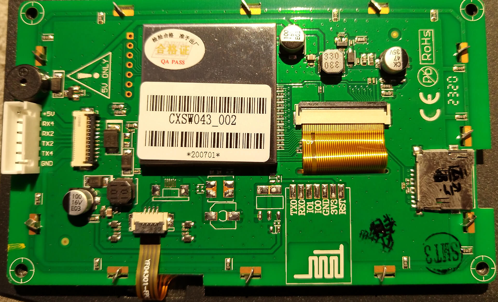

# Screen (stock)

* Brand: [DWIN](http://dwin.com.cn/home/English/index.html)
* Model: CXSW043_002
* Size: 4.3"
* Resolution: 272*480px
* CPU: T5L (ASIC)
* OS: DGUS2*

* WARNING: Creality has shipped multiple versions of DGUS2 OS pre-loaded onto the CR6 stock display.  At version 4.5 and higher, the touchscreen calibration also changed.  Just flashing a DGUS2 version to the screen does NOT change the touchscreen calibration, so flashing a DGUS2 version for which the touchscreen is not calibrated renders the touchscreen inoperable. See these notes for guidance re: how to determine which version is on your display: [How-To-Identify-Which-DGUS2-OS-is-On-Your-DWIN-Display](How-To-Identify-Which-DGUS2-OS-is-On-Your-DWIN-Display.md)

* If you want to recalibrate your touchscreen, Follow [this guidance on our YouTube Channel](https://youtu.be/0xwFGiyg4Z8?si=zGUzkya8_uwCmI5E) 

